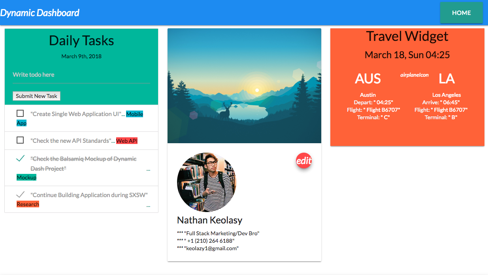
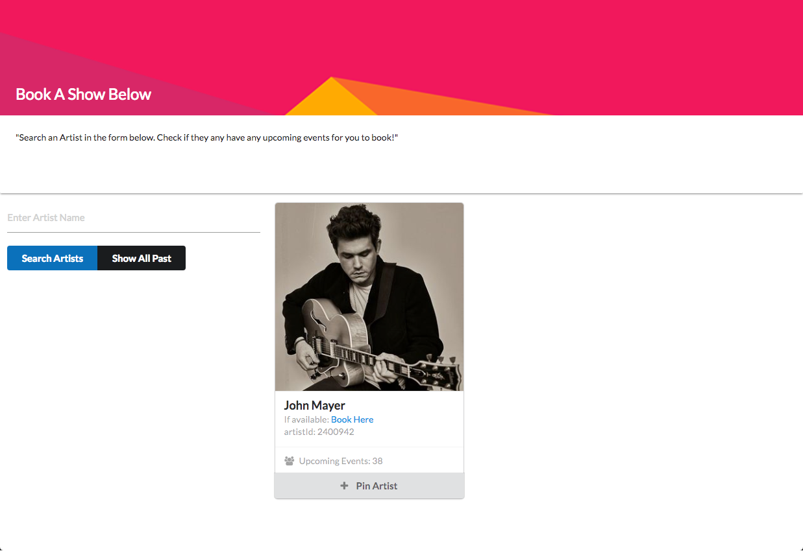

# ui-dashboard

Personalized Dashboard to add on widgets/API features of your choice
User Dashboard: showcases several APIs. Weather, Quote, Random Sale of the Day

## Preview

#

1.  Allow user to search for artists and see if they have upcoming events

2.  "Pin artist" card action to follow a group of artists in their user dashboard (SPA);

## Strech Goals

showcases more popular APIs. Weather, Quote, Random Fact of the Day, etc.

## Project Description

What problem does your project solve? Helps Gather User Perspective and Priorities on a daily basis in one spot.

## Who has this problem?

Everyone could use a central hub to display their desired app widget/api

## How will your project solve this problem?

Offer single page hub for user to assess how to take their day on.

## What outputs does it produce?

Goals list, Insightful Quote of the day, local weather, nice high-res background photo

## What web API(s) will it use?

Bandsintown API. Google Maps API. Quotes REST API.

## What technologies do you plan to use?

HTML 5. Semantic Markup Library. Firebase. JS. HTML5

## Feature list
